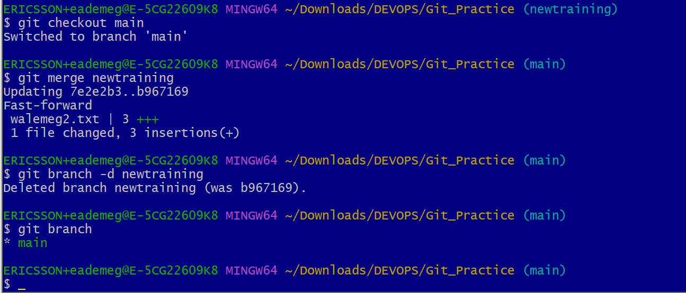

# GIT PROJECT

## Introduction
Git is a version control system (VCS) that solves the problem of sharing code efficiently and keeping track of chnages made to source code. It's a distributed form of VCS which is an improvement on the centralised VCS e.g SVN.

The project below demonstates various actions invlved while working with Git

## 1) Initialising Git

Before I initialised git , I have git first installed on my system and have an existing working directly called Git_Practice. I also ensured I registered my identity (name and email) and branch on Git terminal as shwon below.

After configuring my identity in Git, I moved to the working folder using "cd" command , then initialised Git as shown below.

## 2) Making My First Commit

To commit simply means to save changes made inside the git folder. Changes could be adding , modifying or deleteing files or comment.
In the example below, I use the touch command to create an additional file into my working directory (to an existing file called walemeglinux.txt) called linux2.doc and added it to Git.
See output below

The created file was commited or saved in .git folder using the command "git commit -m "First update to Commiting all files to repository"
 See output below

 

## 3) Working with Branches

A branch can be referred to as a duplicate of precious barnch where changes can be made while still keeping the old information on existing branch.
This concept is applicable to developers especially for testing a new feature (in a separate branch) before merging it to the existing code. 

The output below shows a new branch created called newtraining (the existing branch is called main). The command used is "git checkout -b newtraining".
"git branch" was used to view all existing branches while "git checkout" was used to switch to the existing branch called "main".

## Merging a Branch to another and Deleting git Branch

I have created two branches names "main" and "newtraining". "newtraining" is the new branch created and I adjusted the Devops training course in the walemeg2 text file manually and comiited it to .git. I switched to the previous branch and merged the newtraining branch update to it using command " git merge newtraining"
I later deleted the newtraining branch using "git branch -d newtraining", since I dont need it again

## 4) COLLABORATION AND REMORE REPOSITORIES

Git is used for collaboration amongs remote developers residing in different locations. This is made possible through a web platform called GitHub, where repositories or folders are hosted.

The firs step is to create an account and new repository.
Using my existing account, I created a new repository for the Git Assignment as shown below.

After creating my repository on my local machine, I added it the GitHub repository by first copying the https link as shown below

After commiting my changes in the local repository, I pushed the content into remote repository as shown below

I used Git clone command to create a local copy of my repository in a separate branch so that anyone can make changes there.

## BRANCH MANAGEMENT AND TAGGING
All the markdown syntax are already being used in the documentation in MD format

